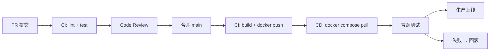

# DevOps 部署（Nginx / Docker / CI/CD）

## 必会基础 ⭐⭐⭐

### Nginx 是什么？正向代理 vs 反向代理

Nginx 是一个高性能的 HTTP 和反向代理服务器，同时支持 IMAP/POP3/SMTP 代理。它以事件驱动（epoll）模型处理请求，单机可支撑数万并发连接。正向代理位于客户端一侧，代表客户端访问外部资源（如翻墙代理）；反向代理位于服务端一侧，代表服务端接收请求并转发给内部服务，对客户端透明——客户端只知道反向代理地址，不知道后端真实服务。

| 对比项 | 正向代理 | 反向代理 |
|---|---|---|
| 位置 | 客户端侧 | 服务端侧 |
| 代表谁 | 代表客户端 | 代表服务端 |
| 客户端感知 | 客户端知道自己用了代理 | 客户端无感知，以为代理就是目标服务 |
| 典型场景 | 科学上网、企业内网出口 | 负载均衡、SSL 终结、静态资源服务 |

### 静态资源服务器配置

Nginx 作为静态资源服务器，通过 `root` 指定文件目录，`index` 定义默认首页文件。`location` 块用于匹配请求路径，可对不同类型的静态资源（JS/CSS/图片/字体）分别设置缓存策略和过期时间。静态资源服务器的优势在于：Nginx 用 C 实现，零拷贝（sendfile）直接发送文件，比 Node.js/Java 等应用层服务高效得多。

```nginx
server {
    listen       80;
    server_name  static.example.com;

    # 静态资源根目录
    location / {
        root   /usr/share/nginx/html;
        index  index.html index.htm;
        try_files $uri $uri/ /index.html;  # SPA 路由回退
    }

    # JS/CSS 文件 — 强缓存
    location ~* \.(js|css)$ {
        root         /usr/share/nginx/html;
        expires      1y;
        add_header   Cache-Control "public, immutable";
    }

    # 图片/字体 — 也设置较长缓存
    location ~* \.(png|jpg|jpeg|gif|ico|svg|woff|woff2|ttf|eot)$ {
        root         /usr/share/nginx/html;
        expires      30d;
        add_header   Cache-Control "public";
    }
}
```

### 反向代理（proxy_pass + location）

反向代理是 Nginx 最核心的功能之一。`proxy_pass` 指令将匹配到的请求转发给指定的后端地址，`location` 决定哪些路径的请求需要代理。常见配置还包括 `proxy_set_header` 向后端传递真实客户端 IP（否则后端只能看到 Nginx IP）、`proxy_read_timeout` 控制超时、`proxy_buffering` 控制是否缓冲响应体。

```nginx
server {
    listen       80;
    server_name  api.example.com;

    # API 请求代理到后端服务
    location /api/ {
        proxy_pass         http://127.0.0.1:3000;      # 后端地址
        proxy_set_header   Host              $host;
        proxy_set_header   X-Real-IP         $remote_addr;
        proxy_set_header   X-Forwarded-For   $proxy_add_x_forwarded_for;
        proxy_set_header   X-Forwarded-Proto $scheme;
        proxy_read_timeout 60s;
        proxy_buffering    off;  # SSE / 流式响应建议关闭
    }

    # WebSocket 代理（需要 Upgrade 头）
    location /ws/ {
        proxy_pass         http://127.0.0.1:3001;
        proxy_http_version 1.1;
        proxy_set_header   Upgrade           $http_upgrade;
        proxy_set_header   Connection        "upgrade";
    }
}
```

### HTTPS 配置（ssl_certificate + HTTP 重定向）

HTTPS 配置涉及 SSL 证书和私钥两个文件。`ssl_certificate` 指向证书链文件（含中间证书），`ssl_certificate_key` 指向私钥文件。推荐同时配置 SSL 协议版本（禁用 TLSv1.0 / TLSv1.1）、加密套件和 HSTS 头。HTTP 80 端口通常只做一个 301 永久重定向到 HTTPS，避免搜索引擎收录 HTTP 版本。

```nginx
# HTTP → HTTPS 重定向
server {
    listen       80;
    server_name  www.example.com;
    return 301   https://$host$request_uri;
}

# HTTPS 主配置
server {
    listen       443 ssl http2;
    server_name  www.example.com;

    ssl_certificate      /etc/nginx/ssl/fullchain.pem;
    ssl_certificate_key  /etc/nginx/ssl/privkey.pem;

    # 安全加固
    ssl_protocols             TLSv1.2 TLSv1.3;
    ssl_ciphers               HIGH:!aNULL:!MD5;
    ssl_prefer_server_ciphers on;
    ssl_session_cache         shared:SSL:10m;
    ssl_session_timeout       10m;

    add_header Strict-Transport-Security "max-age=31536000; includeSubDomains" always;

    location / {
        root   /usr/share/nginx/html;
        index  index.html;
    }
}
```

| 配置项 | 作用 | 推荐值 |
|---|---|---|
| `ssl_protocols` | 限制 TLS 协议版本 | `TLSv1.2 TLSv1.3` |
| `ssl_ciphers` | 限制加密套件 | `HIGH:!aNULL:!MD5` |
| `ssl_session_cache` | 缓存 SSL 会话，减少 TLS 握手 | `shared:SSL:10m` |
| `HSTS` 头 | 强制浏览器始终使用 HTTPS | `max-age=31536000` |

### 负载均衡（upstream + weight / ip_hash）

Nginx 通过 `upstream` 块定义后端服务器组，支持多种负载均衡算法。默认轮询（round-robin），`weight` 按权重分配流量（适合服务器性能不均的场景），`ip_hash` 根据客户端 IP 哈希保证同一客户端始终打到同一后端（解决 Session 一致性问题），`least_conn` 把请求发给当前连接数最少的服务器。生产环境建议使用 `max_fails` + `fail_timeout` 实现被动健康检查。

```nginx
upstream backend_servers {
    # 加权轮询（weight 越大分配越多请求）
    server 192.168.1.10:3000 weight=3 max_fails=3 fail_timeout=30s;
    server 192.168.1.11:3000 weight=1 max_fails=3 fail_timeout=30s;
    server 192.168.1.12:3000 weight=1 backup;        # 备用节点，主节点全挂才启用
    # server 192.168.1.13:3000 down;                  # 标记下线维护

    # 健康检查参数：
    # max_fails  — 最大失败次数，超过后标记为不可用
    # fail_timeout — 不可用状态持续时间，超时后重新尝试
}

upstream sticky_backend {
    ip_hash;  # 同一 IP 始终路由到同一后端
    server 192.168.1.10:3000;
    server 192.168.1.11:3000;
}

server {
    listen       80;
    server_name  api.example.com;

    location / {
        proxy_pass http://backend_servers;
    }
}
```

| 算法 | 指令 | 适用场景 |
|---|---|---|
| 轮询（默认） | — | 后端服务器性能基本一致 |
| 加权轮询 | `weight=N` | 多台服务器性能差异明显 |
| IP 哈希 | `ip_hash` | 需要 Session 保持（无状态化不推荐） |
| 最少连接 | `least_conn` | 长连接场景，避免单台过载 |
| 备用节点 | `backup` | 灾备，主节点全部不可用时顶上 |

### Gzip 压缩

开启 Gzip 压缩可以显著减小传输体积（HTML/CSS/JS 文本类资源通常压缩至原体积的 20%～30%），代价是消耗少量 CPU。`gzip_min_length` 设置最小压缩字节数（太小的文件压缩反而增大），`gzip_types` 指定需要压缩的 MIME 类型（只有文本类型值得压缩，图片/视频本身已压缩无需再压），`gzip_vary` 让代理缓存能区分是否压缩的版本。

```nginx
http {
    gzip              on;
    gzip_min_length   1024;                        # 小于 1KB 不压缩
    gzip_comp_level   6;                           # 压缩级别 1-9，6 是性价比最优
    gzip_types        text/plain text/css
                      application/javascript
                      application/json
                      application/xml
                      text/xml
                      image/svg+xml;
    gzip_vary         on;                          # 响应头加 Vary: Accept-Encoding
    gzip_disable      "msie6";                     # IE6 兼容
    gzip_proxied      any;                         # 对所有代理请求启用压缩
    gzip_buffers      16 8k;                       # 压缩缓冲区
}
```

### 缓存策略（expires + add_header Cache-Control）

Nginx 通过 `expires` 指令设置 `Expires` 响应头（HTTP/1.0），同时自动生成对应的 `Cache-Control: max-age`（HTTP/1.1）。对于带 hash 的构建产物（如 `app.a1b2c3.js`），可以设置永久缓存（`expires 1y` + `immutable`）；对 `index.html` 等入口文件则必须设为不缓存（`expires -1` 或 `no-cache`），确保发版后用户能立即获取新版本。`add_header` 指令可精确追加任意响应头。

```nginx
location / {
    root   /usr/share/nginx/html;
    index  index.html;
    try_files $uri $uri/ /index.html;
}

# index.html 永不缓存（确保发版即时生效）
location = /index.html {
    root              /usr/share/nginx/html;
    add_header        Cache-Control "no-cache, no-store, must-revalidate";
    add_header        Pragma "no-cache";
    add_header        Expires "0";
}

# 带 hash 的资源文件 — 永久缓存（文件名变化即失效）
location ~* \.[a-f0-9]{8,}\.(js|css|png|jpg|jpeg|gif|svg|woff|woff2)$ {
    root              /usr/share/nginx/html;
    expires           1y;
    add_header        Cache-Control "public, immutable";
}
```

| 缓存策略 | 适用文件 | expires | Cache-Control |
|---|---|---|---|
| 永不缓存 | `index.html` | `-1` 或 `epoch` | `no-cache, no-store` |
| 短期缓存 | 无 hash 的静态资源 | `1h` ~ `1d` | `public, max-age=3600` |
| 永久缓存 | 带 contenthash 的文件 | `1y` | `public, immutable` |

### 完整生产 nginx.conf 示例

以下是一个可直接用于生产环境的完整 Nginx 配置，涵盖了 HTTP 重定向、HTTPS、Gzip、静态资源缓存、API 反向代理、WebSocket 代理、负载均衡和安全加固。

```nginx
user  nginx;
worker_processes  auto;
error_log  /var/log/nginx/error.log warn;
pid        /var/run/nginx.pid;

events {
    worker_connections  4096;
    use                 epoll;
    multi_accept        on;
}

http {
    include       /etc/nginx/mime.types;
    default_type  application/octet-stream;

    log_format main '$remote_addr - $remote_user [$time_local] "$request" '
                    '$status $body_bytes_sent "$http_referer" '
                    '"$http_user_agent" "$http_x_forwarded_for"';
    access_log /var/log/nginx/access.log main;

    sendfile        on;
    tcp_nopush      on;
    tcp_nodelay     on;
    keepalive_timeout  65;

    # ===== Gzip =====
    gzip              on;
    gzip_min_length   1024;
    gzip_comp_level   6;
    gzip_types        text/plain text/css application/javascript
                      application/json application/xml text/xml image/svg+xml;
    gzip_vary         on;
    gzip_proxied      any;

    # ===== 上游后端服务 =====
    upstream api_backend {
        least_conn;
        server 10.0.0.1:3000 weight=3 max_fails=3 fail_timeout=30s;
        server 10.0.0.2:3000 weight=2 max_fails=3 fail_timeout=30s;
        server 10.0.0.3:3000 backup;
    }

    upstream ws_backend {
        ip_hash;
        server 10.0.0.1:3001;
        server 10.0.0.2:3001;
    }

    # ===== HTTP → HTTPS =====
    server {
        listen       80;
        server_name  example.com www.example.com;
        return 301   https://$host$request_uri;
    }

    # ===== HTTPS =====
    server {
        listen       443 ssl http2;
        server_name  example.com www.example.com;

        ssl_certificate      /etc/nginx/ssl/fullchain.pem;
        ssl_certificate_key  /etc/nginx/ssl/privkey.pem;
        ssl_protocols        TLSv1.2 TLSv1.3;
        ssl_ciphers          HIGH:!aNULL:!MD5;
        ssl_session_cache    shared:SSL:10m;

        add_header Strict-Transport-Security "max-age=31536000" always;
        add_header X-Frame-Options "DENY" always;
        add_header X-Content-Type-Options "nosniff" always;

        # 静态资源
        location / {
            root   /usr/share/nginx/html;
            index  index.html;
            try_files $uri $uri/ /index.html;
        }

        location = /index.html {
            root              /usr/share/nginx/html;
            add_header        Cache-Control "no-cache, no-store, must-revalidate";
        }

        location ~* \.[a-f0-9]{8,}\.(js|css|svg|png|jpg|woff2?)$ {
            root       /usr/share/nginx/html;
            expires    1y;
            add_header Cache-Control "public, immutable";
        }

        # API 反向代理
        location /api/ {
            proxy_pass         http://api_backend;
            proxy_set_header   Host              $host;
            proxy_set_header   X-Real-IP         $remote_addr;
            proxy_set_header   X-Forwarded-For   $proxy_add_x_forwarded_for;
            proxy_read_timeout 60s;
            proxy_buffering    off;
        }

        # WebSocket
        location /ws/ {
            proxy_pass         http://ws_backend;
            proxy_http_version 1.1;
            proxy_set_header   Upgrade    $http_upgrade;
            proxy_set_header   Connection "upgrade";
        }

        # 健康检查端点
        location /health {
            access_log off;
            return 200 "OK\n";
            add_header Content-Type text/plain;
        }
    }
}
```

## Docker 配置 ⭐⭐⭐

### Dockerfile 核心指令（FROM / COPY / RUN / EXPOSE / CMD）

Dockerfile 是构建 Docker 镜像的声明式脚本，每条指令产生一个新的镜像层。`FROM` 指定基础镜像；`COPY` 将宿主机文件复制到镜像内（优先于 `ADD`，因为 ADD 会自动解压 tar 等副作用）；`RUN` 在镜像构建时执行命令（如安装依赖）；`EXPOSE` 声明容器运行时监听的端口（仅文档作用，实际映射由 `-p` 指定）；`CMD` 定义容器启动时的默认命令（可被 `docker run` 参数覆盖）。Docker 会缓存每一层，只有变化层的后续层才会重新构建——因此 `COPY package.json` 应在 `RUN npm install` 前，而非复制全部源码后再安装。

| 指令 | 用途 | 注意事项 |
|---|---|---|
| `FROM` | 指定基础镜像 | 尽量用 `alpine` 或 `slim` 缩小体积 |
| `COPY` | 复制文件到镜像 | 优先于 ADD（ADD 有隐式解压行为） |
| `RUN` | 构建时执行命令 | 合并多条命令为一条以减少层数：`RUN cmd1 && cmd2` |
| `EXPOSE` | 声明监听端口 | 仅文档用途；实际映射用 `docker run -p` |
| `CMD` | 容器默认启动命令 | JSON 数组形式：`CMD ["node","server.js"]` |
| `ENTRYPOINT` | 容器入口点 | 与 CMD 配合：ENTRYPOINT 固定，CMD 为默认参数 |
| `WORKDIR` | 设置工作目录 | 后续指令相对路径的基础 |
| `ENV` | 设置环境变量 | 构建时和运行时均可用 |

### .dockerignore

`.dockerignore` 文件用于排除不需要复制到镜像中的文件和目录，减少构建上下文大小（加速 `docker build`）、避免敏感文件泄露（`.env`、`.git`）和防止 `node_modules` 覆盖镜像内安装的依赖。语法与 `.gitignore` 类似，支持通配符和取反规则。

```txt
# 依赖
node_modules
.pnpm-store

# 构建产物
dist
build
.output

# Git / IDE
.git
.gitignore
.vscode
.idea

# 环境变量（含密钥，切勿打进镜像）
.env
.env.*
!.env.example

# 测试 / 文档
tests
__tests__
*.test.ts
*.spec.ts
docs
README.md

# 操作系统
.DS_Store
Thumbs.db

# CI / 日志
.github
*.log
npm-debug.log*
```

### 前端 Dockerfile 示例（多阶段构建：build → nginx）

多阶段构建是 Docker 17.05+ 的核心特性：第一个阶段（`builder`）安装 Node.js + 全部依赖，执行 `npm run build`；第二个阶段（`runner`）只复制构建产物到 Nginx 镜像中。最终镜像不包含 `node_modules`、源码、构建工具链，体积从 1GB+ 骤降至几十 MB。这是一个前端项目 Dockerfile 的经典实践。

```dockerfile
# ===== 阶段 1：构建 =====
FROM node:20-alpine AS builder

WORKDIR /app

# 先复制包管理文件（利用 Docker 层缓存）
COPY package.json pnpm-lock.yaml ./

# 安装 pnpm 并安装依赖
RUN npm install -g pnpm && pnpm install --frozen-lockfile

# 复制源码并构建
COPY . .
RUN pnpm run build

# ===== 阶段 2：运行 =====
FROM nginx:1.27-alpine AS runner

# 复制构建产物到 nginx 目录
COPY --from=builder /app/dist /usr/share/nginx/html

# 复制自定义 nginx 配置
COPY nginx.conf /etc/nginx/conf.d/default.conf

EXPOSE 80

CMD ["nginx", "-g", "daemon off;"]
```

| 构建阶段 | 基础镜像 | 包含内容 | 镜像大小 |
|---|---|---|---|
| builder | `node:20-alpine` | Node.js、依赖、源码、构建产物 | ~500MB |
| runner | `nginx:1.27-alpine` | 仅 Nginx + 构建产物 + 配置 | ~20MB |

### docker-compose.yml（前端 + 后端 + Nginx 三服务）

Docker Compose 用 YAML 声明多容器应用的编排关系。以下示例定义三个服务：`frontend`（前端静态资源）、`backend`（Node.js API 服务）、`nginx`（反向代理网关）。所有服务共享同一个自定义网络，Nginx 通过服务名（`frontend`、`backend`）直接访问其他容器——Docker 内置 DNS 会自动解析服务名为容器 IP。

```yaml
version: "3.9"

services:
  frontend:
    build:
      context: ./frontend
      dockerfile: Dockerfile
    container_name: app-frontend
    restart: unless-stopped
    networks:
      - app-network

  backend:
    build:
      context: ./backend
      dockerfile: Dockerfile
    container_name: app-backend
    restart: unless-stopped
    environment:
      - NODE_ENV=production
      - DB_HOST=mysql
      - REDIS_HOST=redis
    depends_on:
      mysql:
        condition: service_healthy
      redis:
        condition: service_started
    networks:
      - app-network

  nginx:
    image: nginx:1.27-alpine
    container_name: app-nginx
    restart: unless-stopped
    ports:
      - "80:80"
      - "443:443"
    volumes:
      - ./nginx/nginx.conf:/etc/nginx/conf.d/default.conf:ro
      - ./nginx/ssl:/etc/nginx/ssl:ro
    depends_on:
      - frontend
      - backend
    networks:
      - app-network

  mysql:
    image: mysql:8.4
    container_name: app-mysql
    restart: unless-stopped
    environment:
      MYSQL_ROOT_PASSWORD: ${MYSQL_ROOT_PASSWORD}
      MYSQL_DATABASE: ${MYSQL_DATABASE}
    volumes:
      - mysql-data:/var/lib/mysql
    healthcheck:
      test: ["CMD", "mysqladmin", "ping", "-h", "localhost"]
      interval: 10s
      timeout: 5s
      retries: 5
    networks:
      - app-network

  redis:
    image: redis:7-alpine
    container_name: app-redis
    restart: unless-stopped
    volumes:
      - redis-data:/data
    networks:
      - app-network

networks:
  app-network:
    driver: bridge

volumes:
  mysql-data:
  redis-data:
```

### 常用命令速查

Docker 常用操作覆盖镜像生命周期（构建 → 推送 → 拉取 → 删除）、容器生命周期（启动 → 停止 → 进入 → 日志）、以及组合命令（`docker-compose`）。以下为日常开发部署中最常用的命令。

```bash
# ===== 镜像管理 =====
docker build -t my-app:latest .                    # 构建镜像
docker build --no-cache -t my-app:latest .          # 无缓存构建
docker images                                        # 列出本地镜像
docker rmi my-app:latest                             # 删除镜像
docker tag my-app:latest registry.cn/my-app:v1.0     # 打标签
docker push registry.cn/my-app:v1.0                  # 推送镜像

# ===== 容器管理 =====
docker run -d -p 8080:80 --name my-app my-app:latest # 后台运行 + 端口映射
docker run -it my-app sh                              # 交互式进入容器
docker ps                                             # 运行中的容器
docker ps -a                                          # 全部容器（含已停止）
docker stop my-app                                    # 停止容器
docker rm my-app                                      # 删除容器
docker exec -it my-app sh                             # 进入运行中的容器
docker logs -f --tail=100 my-app                      # 实时查看日志

# ===== Docker Compose =====
docker compose up -d                                  # 后台启动所有服务
docker compose down                                   # 停止并删除所有容器
docker compose down -v                                # 同时删除 volumes
docker compose build --no-cache                       # 强制重建镜像
docker compose restart frontend                       # 重启单个服务
docker compose logs -f backend                        # 查看单个服务日志
docker compose ps                                     # 查看所有服务状态

# ===== 清理 =====
docker system prune -a                                # 删除所有未使用的镜像/容器/网络
docker volume prune                                   # 删除未使用的 volumes

# ===== 调试 =====
docker inspect my-app                                 # 查看容器/镜像详细信息
docker stats                                          # 实时容器资源使用
```

## CI/CD 基础 ⭐⭐

### 什么是 CI/CD？

CI（持续集成）指开发者频繁地将代码合并到主干，每次合并自动触发构建和测试，及早发现集成问题。CD 有两种解读：持续交付（Continuous Delivery）指代码随时可手动部署到生产；持续部署（Continuous Deployment）指通过 CI 的代码自动部署到生产环境。前端项目的典型 CI/CD 流程：`git push → lint + test → build → upload artifacts → deploy to server`。常用的 CI/CD 平台包括 GitHub Actions、GitLab CI、Jenkins、Vercel 等。

### GitHub Actions 部署前端到服务器

GitHub Actions 通过 `.github/workflows/*.yml` 文件定义工作流。核心概念：`on` 定义触发条件（push / pull_request / schedule），`jobs` 定义执行任务，`steps` 定义每个任务的步骤序列。`secrets` 用于存储敏感信息（服务器 IP、SSH 私钥等），运行时通过 `${{ secrets.XXX }}` 引用。`actions/checkout` 拉取仓库代码，`actions/setup-node` 配置 Node.js 环境。

```yaml
# .github/workflows/deploy.yml
name: Deploy to Production

on:
  push:
    branches: [main]
  workflow_dispatch:  # 支持手动触发

jobs:
  build-and-deploy:
    runs-on: ubuntu-latest

    steps:
      # 1. 拉取代码
      - name: Checkout
        uses: actions/checkout@v4

      # 2. 安装 Node.js
      - name: Setup Node.js
        uses: actions/setup-node@v4
        with:
          node-version: 20
          cache: 'pnpm'

      # 3. 安装 pnpm
      - name: Install pnpm
        run: npm install -g pnpm

      # 4. 安装依赖
      - name: Install Dependencies
        run: pnpm install --frozen-lockfile

      # 5. 代码检查
      - name: Lint
        run: pnpm run lint

      # 6. 运行测试
      - name: Test
        run: pnpm run test

      # 7. 构建
      - name: Build
        run: pnpm run build

      # 8. 部署到服务器（rsync）
      - name: Deploy to Server
        uses: easingthemes/ssh-deploy@v5
        with:
          SSH_PRIVATE_KEY: ${{ secrets.SSH_PRIVATE_KEY }}
          REMOTE_HOST: ${{ secrets.REMOTE_HOST }}
          REMOTE_USER: ${{ secrets.REMOTE_USER }}
          SOURCE: "dist/"
          TARGET: "/var/www/html/"
          ARGS: "-rlgoDzvc --delete"
          SCRIPT_AFTER: |
            sudo nginx -t && sudo nginx -s reload
```

### 部署流程详解

| 步骤 | 工具/方式 | 说明 |
|---|---|---|
| 触发 | `on.push.branches` | 推送到 main 分支自动触发 |
| 拉代码 | `actions/checkout` | 将仓库代码检出到 runner |
| 环境准备 | `actions/setup-node` | 安装指定版本 Node.js + 缓存 |
| 安装依赖 | `pnpm install --frozen-lockfile` | 严格按 lockfile 安装，CI 环境不更新锁 |
| 代码检查 | `pnpm lint` | ESLint + TypeScript 类型检查 |
| 测试 | `pnpm test` | 单元测试 + 集成测试 |
| 构建 | `pnpm build` | Vite/Webpack 生产构建 |
| 上传产物 | rsync / scp | 只同步差异文件（`--delete` 清除远程多余文件） |
| 重启服务 | `nginx -s reload` | 平滑重启，不中断现有连接 |

## 常见面试题 ⭐⭐⭐

### Nginx 如何做反向代理和负载均衡？

**反向代理**：Nginx 通过 `proxy_pass` 将客户端请求转发给后端服务，客户端不知道后端真实地址。在 `location` 块中设置 `proxy_pass http://backend_server`，配合 `proxy_set_header` 传递真实客户端 IP（`X-Real-IP`、`X-Forwarded-For`）。反向代理的作用包括：隐藏后端服务、SSL 终结（Nginx 处理 HTTPS，后端用 HTTP）、统一入口便于日志和限流。

**负载均衡**：通过 `upstream` 块定义后端服务器池，Nginx 默认轮询分发请求。支持多种算法：`weight` 加权轮询（性能不均时用）、`ip_hash` 按客户端 IP 哈希（会话保持）、`least_conn` 最少连接数优先、`random` 随机选择。配合 `max_fails` + `fail_timeout` 实现被动健康检查——某台后端连续失败 N 次后，Nginx 会在 `fail_timeout` 时间内不再向它转发请求。生产环境常配合 `keepalive` 保持与后端的 HTTP 长连接，减少 TCP 握手开销。

```nginx
# 反向代理 + 负载均衡 核心片段
upstream my_app {
    least_conn;
    server 10.0.0.1:3000 weight=3 max_fails=2 fail_timeout=30s;
    server 10.0.0.2:3000 weight=2 max_fails=2 fail_timeout=30s;
    server 10.0.0.3:3000 backup;
    keepalive 32;  # 与后端保持长连接数
}

server {
    location /api/ {
        proxy_pass         http://my_app;
        proxy_set_header   X-Real-IP  $remote_addr;
        proxy_http_version 1.1;
        proxy_set_header   Connection "";
    }
}
```

### Docker 多阶段构建优点？

多阶段构建的核心价值："构建一次，只带走的才是真正需要的"。**① 镜像体积大幅减小**：第一阶段用 Node.js 镜像安装依赖和构建，第二阶段只用 Nginx 镜像复制产物——最终镜像不含 `node_modules`（通常 300MB+）、源码、构建工具链，体积从 GB 级降至几十 MB。**② 安全性提升**：运行时镜像不含编译器、包管理器、源码，攻击面显著缩小。**③ 构建缓存更高效**：Docker 层缓存机制下，`package.json` 不变则依赖安装层被复用，只重新执行源码复制和构建步骤。**④ 单一 Dockerfile 管理**：无需维护两个 Dockerfile（一个构建、一个运行），也不需要外部脚本协调，CI/CD 流程更简洁。

| 对比维度 | 单阶段构建 | 多阶段构建 |
|---|---|---|
| 最终镜像大小 | 500MB ~ 1.5GB | 20MB ~ 80MB |
| 含 Node.js / 构建工具 | ✅ 是 | ❌ 否（仅 Nginx） |
| 含 `node_modules` | ✅ 是 | ❌ 否 |
| 攻击面 | 大（含编译器、源码） | 小（仅静态文件 + Nginx） |
| Dockerfile 数量 | 通常 1 个 | 1 个（含多个 FROM） |

### 你们的部署流程是什么样的？

**回答思路**（以典型前端项目为例）：从代码合入到生产上线，整个流程分为几个阶段——

① **代码提交阶段**：开发在 feature 分支开发完成后提交 PR，触发 CI 跑 lint + type-check + 单元测试。全部通过后由同事 Code Review，合并到 main 分支。

② **CI 构建阶段**：main 分支 push 触发 GitHub Actions。流水线执行：checkout → 安装依赖（`pnpm install --frozen-lockfile`）→ ESLint + TypeScript 检查 → 单元测试 → 生产构建（`pnpm build`）→ 构建 Docker 镜像 → 推送到容器镜像仓库（阿里云 ACR / Docker Hub）。

③ **部署阶段**：CD 流水线（或手动触发）通过 SSH 登录服务器，执行 `docker compose pull` 拉取最新镜像，然后 `docker compose up -d` 滚动更新。前端是 Nginx 容器，只需替换静态资源 + reload。使用 `depends_on` 控制启动顺序。

④ **发布验证**：部署完成后执行冒烟测试（健康检查端点 + 关键页面可访问性），监控错误率和日志是否有异常。如有问题，通过 `docker compose down && docker compose up -d`（使用上一版本镜像标签）快速回滚。

⑤ **监控告警**：接入 Sentry 捕获前端错误，Grafana + Prometheus 监控服务器资源和服务可用性，异常时钉钉/企微告警。



## 补充知识 ⭐

### Nginx 常用全局配置 & 性能优化

Nginx 全局配置直接影响并发能力和资源利用。`worker_processes auto` 让 Nginx 自动匹配 CPU 核数，每个 worker 是独立的单线程进程，通过 epoll 事件驱动在一个进程内处理数万连接。`worker_connections` 决定每个 worker 可同时打开的连接数，总并发 = `worker_processes × worker_connections`。`sendfile on` + `tcp_nopush on` 启用零拷贝技术，直接在内核空间将文件数据发送到 socket，避免内核态到用户态的拷贝。

```nginx
# 性能相关的全局配置
worker_processes   auto;           # 按 CPU 核数自动设置
worker_rlimit_nofile 65535;        # worker 最大文件打开数

events {
    worker_connections  4096;      # 每个 worker 最大连接数
    use                 epoll;        multi_accept        on;
}

http {
    sendfile            on;
    tcp_nopush          on;
    tcp_nodelay         on;
    keepalive_timeout   65;
    client_max_body_size 20m;       # 限制请求体大小（防攻击）
    server_tokens       off;        # 隐藏 Nginx 版本号
}
```

### Docker 网络模式对比

Docker 提供多种网络驱动，理解它们对于多容器通信至关重要。`bridge`（默认）创建独立的虚拟网桥，容器通过服务名互相发现；`host` 直接使用宿主机网络栈，性能最高但失去隔离性；`overlay` 用于跨主机的 Swarm 集群容器通信；`none` 完全隔离网络。

| 网络模式 | 容器间通信 | 宿主机端口映射 | 适用场景 |
|---|---|---|---|
| bridge | ✅ 服务名 DNS | ✅ -p 映射 | 单机多容器应用 |
| host | ✅ localhost | 直接监听宿主机端口 | 高性能网络需求 |
| overlay | ✅ 跨主机 | — | Docker Swarm 集群 |
| none | ❌ | ❌ | 安全隔离场景 |

### Docker 数据持久化：Volume vs Bind Mount

Docker 容器是无状态的，重启后文件系统变更会丢失。数据持久化有两种方式：Volume（由 Docker 管理，存储在 `/var/lib/docker/volumes/`）和 Bind Mount（挂载宿主机任意路径）。Volume 是推荐方式——它由 Docker 管理生命周期、驱动支持远程存储、性能更好；Bind Mount 适合开发环境（实时同步代码）。

```bash
# Volume（推荐生产使用）
docker run -v mysql-data:/var/lib/mysql mysql:8.4

# Bind Mount（适合开发）
docker run -v $(pwd)/src:/app/src node:20-alpine
```

| 方式 | 路径管理 | 跨平台 | 适用场景 |
|---|---|---|---|
| Volume | Docker 自动管理 | ✅ 好 | 数据库、生产环境 |
| Bind Mount | 用户指定宿主机绝对路径 | ⚠️ 路径差异 | 开发热重载 |

### 常见 CI/CD 平台对比

| 平台 | 配置文件 | 免费额度 | 特点 |
|---|---|---|---|
| GitHub Actions | `.github/workflows/*.yml` | 公开仓库免费，私有 2000min/月 | GitHub 生态紧密集成 |
| GitLab CI | `.gitlab-ci.yml` | 400min/月 | 内置镜像仓库，Auto DevOps |
| Jenkins | Jenkinsfile | 自托管，无限制 | 最灵活，插件生态最丰富 |
| Vercel | 自动检测框架 | 爱好版免费 | 零配置，前端项目首选 |
| Netlify | `netlify.toml` | 300min/月 | Git 驱动的 JAMStack 部署 |

### 蓝绿部署 vs 滚动更新 vs 灰度发布

三种主流的零停机部署策略。蓝绿部署：维护两套完全相同的生产环境（蓝/绿），部署时切换到闲置环境，验证后流量全部切换，回滚只需切回。滚动更新：逐个替换实例（Kubernetes 默认），同时有新老版本共存。灰度发布（金丝雀）：先让少量用户尝鲜新版本，观察无异常后逐步扩大比例。

| 策略 | 回滚速度 | 资源成本 | 问题检测 |
|---|---|---|---|
| 蓝绿部署 | 秒级（流量切换） | 2 倍资源 | 全量切换后才暴露 |
| 滚动更新 | 逐步回滚 | 1.x 倍 | 过程中可发现 |
| 灰度发布 | 切回小流量即可 | 1.x 倍 | 小范围暴露问题 |

### 面试追问：Nginx 的 `try_files` 指令是做什么的？

`try_files` 按顺序检查文件是否存在，找到第一个存在的文件就返回它，都不存在则走最后一个 fallback。前端 SPA（Vue/React Router）的 history 模式下，直接访问 `/about` 时 Nginx 找不到对应的静态文件会返回 404；通过 `try_files $uri $uri/ /index.html`，让所有未匹配到静态文件的路由都回退到 `index.html`，由前端路由接管处理。

```nginx
# SPA 必备配置
location / {
    root   /usr/share/nginx/html;
    index  index.html;
    try_files $uri $uri/ /index.html;
    # $uri        → 请求的路径对应的文件
    # $uri/       → 请求的路径对应的目录
    # /index.html → 都没有 → 回退到 index.html（前端路由接管）
}
```
